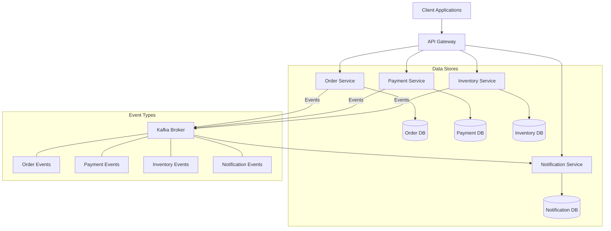
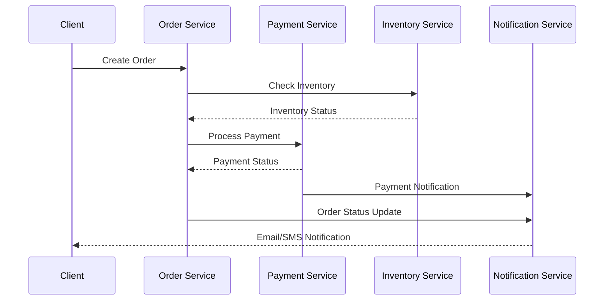

# Event-Driven Order Processing System (Microservices)

## Project Overview

This project implements a scalable e-commerce system using microservices architecture and event-driven design patterns. The system handles the complete lifecycle of order processing, from order creation to notification delivery, ensuring reliability and consistency across distributed services.

### Key Features

- **Event-Driven Architecture**: Utilizes Apache Kafka for asynchronous communication between services
- **Distributed Transaction Management**: Implements the Saga pattern for maintaining data consistency
- **Scalable Design**: Each service can be scaled independently based on load
- **Fault Tolerance**: Implements circuit breakers and retry mechanisms
- **Real-time Notifications**: Supports both email and SMS notifications
- **Data Consistency**: Uses event sourcing for maintaining data consistency across services

## Prerequisites

### Required Tools

1. **Java Development Kit (JDK)**
   - Version: 17 or higher
   - Installation:
     ```bash
     # For macOS (using Homebrew)
     brew install openjdk@17
     
     # For Ubuntu
     sudo apt-get install openjdk-17-jdk
     ```

2. **Maven**
   - Version: 3.6 or higher
   - Installation:
     ```bash
     # For macOS
     brew install maven
     
     # For Ubuntu
     sudo apt-get install maven
     ```

3. **Docker & Docker Compose**
   - Installation:
     ```bash
     # For macOS
     brew install docker docker-compose
     
     # For Ubuntu
     sudo apt-get install docker.io docker-compose
     ```

4. **Apache Kafka**
   - Version: 3.0 or higher
   - Installation via Docker will be covered in setup instructions

## Architecture Overview

### High-Level Architecture


### Service Communication Flow


## Detailed Service Description

### 1. Order Service
- **Responsibility**: Central service for order management
- **Features**:
  - Order creation and validation
  - Order status management
  - Integration with other services
- **Events Published**:
  - OrderCreatedEvent
  - OrderUpdatedEvent
  - OrderCancelledEvent

### 2. Payment Service
- **Responsibility**: Handles all payment-related operations
- **Features**:
  - Payment processing
  - Refund handling
  - Payment status tracking
- **Events Published**:
  - PaymentProcessedEvent
  - PaymentFailedEvent
  - RefundInitiatedEvent

### 3. Inventory Service
- **Responsibility**: Manages product inventory
- **Features**:
  - Stock level management
  - Inventory reservations
  - Stock updates
- **Events Published**:
  - StockReservedEvent
  - StockReleasedEvent
  - LowStockEvent

### 4. Notification Service
- **Responsibility**: Handles all customer communications
- **Features**:
  - Email notifications
  - SMS notifications
  - Notification history tracking
- **Events Consumed**:
  - OrderEvents
  - PaymentEvents
  - InventoryEvents

## Setup and Installation

### 1. Clone and Build

```bash
# Clone the repository
git clone <repository-url>
cd event-driven-order-processing

# Build all services
mvn clean install
```

### 2. Database Setup

```bash
# Start H2 Database (Development)
# H2 console will be available at http://localhost:8081/h2-console

# For Production (PostgreSQL)
docker run --name postgres -e POSTGRES_PASSWORD=postgres -p 5432:5432 -d postgres
```

### 3. Start Kafka

```bash
# Using Docker Compose
docker-compose up -d kafka zookeeper

# Verify Kafka is running
docker ps
```

### 4. Start Services

```bash
# Start each service in separate terminals

# Notification Service
cd notification-service
mvn spring-boot:run

# Order Service
cd order-service
mvn spring-boot:run

# Payment Service
cd payment-service
mvn spring-boot:run

# Inventory Service
cd inventory-service
mvn spring-boot:run
```

## Testing the Services

### 1. Notification Service Endpoints

#### Create Notification
```bash
curl -X POST "http://localhost:8081/api/notifications" \
  -H "Content-Type: application/json" \
  -d '{
    "orderId": 12345,
    "customerId": "CUST123",
    "type": "EMAIL",
    "recipient": "test@example.com",
    "subject": "Order Confirmation",
    "content": "Your order has been confirmed"
  }'
```

#### Send Email
```bash
curl -X POST "http://localhost:8081/api/notifications/email" \
  -H "Content-Type: application/json" \
  -d '{
    "recipient": "test@example.com",
    "subject": "Test Email",
    "content": "This is a test email"
  }'
```

#### Send SMS
```bash
curl -X POST "http://localhost:8081/api/notifications/sms" \
  -H "Content-Type: application/json" \
  -d '{
    "recipient": "+1234567890",
    "content": "This is a test SMS"
  }'
```

#### Get Notifications by Order ID
```bash
curl "http://localhost:8081/api/notifications/order/12345"
```

### 2. Monitoring

- **H2 Console**: http://localhost:8081/h2-console
- **Actuator Endpoints**: http://localhost:8081/actuator
- **Swagger UI**: http://localhost:8081/swagger-ui.html

## Error Handling

The system implements robust error handling:

1. **Retry Mechanism**
   - Failed notifications are automatically retried
   - Configurable retry count and delay
   - Dead Letter Queue for failed messages

2. **Circuit Breaker**
   - Prevents cascade failures
   - Automatic service degradation
   - Fallback mechanisms

3. **Error Logging**
   - Detailed error logging
   - Error tracking and monitoring
   - Alert mechanisms for critical failures

## Contributing

1. Fork the repository
2. Create your feature branch (`git checkout -b feature/AmazingFeature`)
3. Commit your changes (`git commit -m 'Add some AmazingFeature'`)
4. Push to the branch (`git push origin feature/AmazingFeature`)
5. Open a Pull Request

## Troubleshooting

### Common Issues

1. **Port Already in Use**
   ```bash
   # Check ports in use
   lsof -i :<port-number>
   
   # Kill process using port
   kill -9 <PID>
   ```

2. **Database Connection Issues**
   - Verify H2 console is accessible
   - Check database credentials
   - Ensure database service is running

3. **Kafka Connection Issues**
   - Verify Kafka and Zookeeper are running
   - Check Kafka connection properties
   - Ensure topics are created properly

## License

This project is licensed under the MIT License - see the LICENSE file for details.

## Acknowledgments

- Spring Boot and Spring Cloud teams
- Apache Kafka community
- All contributors to this project 